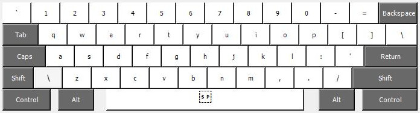

# ANSI, but more Finnish

Improved ANSI layout with ä, ö and å.

## Installation

Download latest release and run setup.exe.

## Uninstallation

Run setup.exe again and select uninstall.

## Editing

Edit `finsi.klc` with [Microsoft Keyboard Layout Creator](https://www.microsoft.com/en-us/download/details.aspx?id=22339).

## Layout

**Default layer:**

**Shift layer:**

**AltGr (Ctrl + Alt) layer:**

**Shift AltGr (Shift + Ctrl + Alt) layer:**

